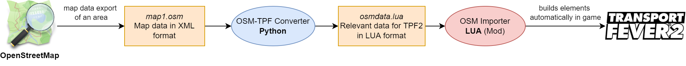

# OSM-TPF2 Importer

This is a tool for the simulation game [Transport Fever 2](https://www.transportfever2.com/) (TPF2) for the automated reconstruction of real world places using OpenStreetMap data.

Few players have dared to start a "Rebuilding project" (virtual reconstruction of real environments) in TPF2 and maybe you already thought of recreating your home town.
However, often motivation runs out after a while, simply because of the sheer number of tracks, roads, buildings, etc to rebuild, quickly becoming monotonous.

OpenStreetMap (OSM) provides detailed, worldwide, free map data, containing streets, railways, buildings, land use, vegetation and much more.
Therefore, this tool aims at using this data to bring it into TPF2 in an automated way.
Currently, tracks, streets, forests, ground surfaces, town labels, and some point objects can be imported.
This tool can be used as a starting point to accelerate the replication of a real world area in TPF2.
Having the basic structures, like infrastructure and vegetation quickly on the map might help to keep the motivation on continuing with the reconstruction project.

**Despite the automation, this is no "one-click" tool!**
You need to have basic TPF2 knowlegde and a bit of LUA experience. 
I created a comprehensive tutorial, but I don't cover TPF2 basics.

While dealing with OSM data and the TPF2 modding interface, several challenges have been encountered and approached in this tool in order to convert, transform, and optimize the OSM data accordingly and make it usable in a sandbox transport simulation game, as Transport Fever 2.

Demonstration Video: https://youtu.be/V_L-CaPWk1Y
  --  More pictures [here](https://www.transportfever.net/gallery/album/3768)

## Basics for Map Creation

Before using this tool, you should be familiar with the basics of TPF2 and map creation in general.
Basic information, considerations, and requirements for "Rebuilding projects" can be found in my [steam guide](https://steamcommunity.com/sharedfiles/filedetails/?id=3283539648) or this [article in the tfnet forum (german)](https://www.transportfever.net/lexicon/entry/398-real-nachbau-in-tpf-2/).

Before applying OSM-Importer, you need to define your area of interest, create an ingame overlay, and get a heightmap (optional for flat regions).

## OpenStreetMap
[OpenStreetMap (OSM)](https://www.openstreetmap.org/) has been a successful project since 2004 to establish a free, open map database that anyone can contribute to. 
The database consists of streets, footpaths, railway lines, building outlines, power lines, land use (e.g. forests), ... and even objects such as garbage cans. 
Not all data is displayed on the main page.
Some may know [OpenRailwayMap](https://www.openrailwaymap.org/), which uses the same data basis, but a different visualization (e.g. signals or demolished tracks).

There are 3 basic element types in OSM: 
- Nodes (points with coordinates)
- Ways (list of connected nodes), closed ways represent areas
- Relations (additional information on nodes and ways)

The associated XML tags contain further information to describe the object. 
In practice however, the degree of mapping detail can vary.
You can take a closer look via the object query using right-click to explore the underlying elements and their tags (e.g. [way 48905770](https://www.openstreetmap.org/way/48905770)).
There is an extensive documentation about the meaning of tags and values.

The different representation of streets and tracks requires some adjustments.
For example, maps like OSM do not contain real curves, in contrast to games like TPF2.
The OSM data needs to be processed and some optimizations are necessary to make the data usable in the game.
More details [here](/python/README.md#details).

## OSM Data used
The following information from OSM elements is used and extracted during the automated import:

- Streets and footpaths
    - type of street (e.g. urban, rural, motorway)
    - number of lanes, one-way
    - sidewalk
    - surface
- Railway tracks
    - catenary/powerrail
    - gauge
    - max speed
    - signals
- Bridges
- Rivers/Streams
- Forests/Shrubs
    - leaf type
- Ground Surface Areas
    - e.g. fields, pavement, land use
- Towns/Quarters location (names are displayed as fake town labels)
- Point objects
    - fountains
    - single trees
    - bollards
    - advertising pillars

Not all data can be used for automation.
For example, stations are mapped in detail in OSM, but have to be manually built in TPF2.
Building contours are extensively mapped, but there is no simple way to create appropriate automation for this.

## Toolchain
This is the toolchain visualizing the approach.
The tool is split in two parts.

OSM data is provided in an XML format. 
To facilitate the data filtering, processing, and transformation, the intermediate processing steps are carried out in a Python tool, the "Converter".

The Converter reads the OSM data, filters it according to the relevant data needed for TPF2, does some optimizations, and generates a convenient Lua file for TPF2 with the data in a suitable form.
For example, the world coordinates are transformed into map coordinates. 
Moreover, edges are optimized and tangent vectors are calculated for appropriate curves. 

On the TPF2 side, there is a script mod to read the generated Lua file and conduct the import in TPF2.
The whole project folder is basically a mod that needs to be activated.
In the game, the console is used to access the script functions and start the construction process.
The TPF2 modding API is used to automagically build the streets, tracks, forests and more. 

## Documentation/Tutorial
[Here is a full tutorial](/doc/Tutorial.md) on how to use the tool.
It explains all steps, how to obtain OSM data, prepare the map, how to use the toolchain, and the postprocessing.

The two parts of the tool are documented seperately:
- [OSM-TPF Converter (Python)](/python)
- [OSM Builder (Lua/Mod)](/res/scripts/osm_importer)

## Mods
OSM-Importer is designed to make use of some brilliant TPF2 Mods in order to increase realism and use dedicated objects/types more appropriate than the vanilla resources.
With the data and details provided in OSM, suitable street/track/bridge/signal types can be determined.
I have carefully selected those mods and searched for the best solution.
Many of them will become useful for Replication projects anyway.

Find the [required mods here](/doc/Mods.md).

## Limitations
- Not everything can be automated.
Rebuilding projects still require significant manual preperation and postprocessing after the import to optimize the result.

- The result depends on the accuracy and provided details in OSM tags, which differs locally and worldwide.
The processing algorithms of this tool can't create perfect geometries if curves are mapped too inprecisely.
If details on street or track properties (e.g. speed) are missing, the result in the game might be inappropriate.
But as OSM evolves over time, results will improve in future!

- Often, not all streets/tracks can be built successfully, especially when there are many short segments within a small area, like complex intersections. 
These have to be built in TPF2 in another way anway.

- The process of importing streets and tracks can take a lot of time (several hours, depending on the map size and density).
This is because single edges have to be built subsequently.

## Performance Impacts
General performance discussion for reconstruction projects is given in the reconstruction guide ([EN](https://steamcommunity.com/sharedfiles/filedetails/?id=3283539648) | [DE](https://www.transportfever.net/lexicon/entry/398-real-nachbau-in-tpf-2)).
With the OSM Import in particular, a huge number of elements is brought into the game at once, presenting a new type of impact that barely anyone has experienced yet.

RAM turned out to be a critical factor, especially for large maps containing urban areas because of the extreme number of track/street segments (edges).
As an example, my meglomaniac Frankfurt map [includes 300 000 edges, resulting in 40 GB RAM!](https://steamcommunity.com/sharedfiles/filedetails/?id=3273019567)
In usual TPF2 games, even 30 000 edges would be reached only in big savegames.
If RAM usage is higher than the physical memory, the page file is heavily used, leading to stutters, especially when moving the map.
Also, the savegame size becomes very large and saving times get higher.

Therefore, consider this impact and make tests early on to estimate if your savegame will still run smoothly on your hardware after the import!
If not, you either need to buy more RAM, choose a smaller map size, or reduce the number of edges by excluding certain types (more info in the tutorial).
In the reconstruction guide, I tried to estimate the required RAM (column 'high').
The infrastructure density has a major influence, i.e. rural areas are less affected by this issue compared to urban areas.

## More Info
History and further information of OSM-Importer can be found in the [forum thread (german)](https://www.transportfever.net/thread/20034-osm-importer-automatisierter-nachbau-mit-openstreetmap/).

My development on this tool started 2021, in combination with the project of reconstructing Frankfurt and vicinity.
Progress was slow, including several breaks, and much [trial and error](https://www.youtube.com/watch?v=lsg3J13nJbE), but here we are.
During the development, other mods emerged.
Most notably, [Build with Collision](https://steamcommunity.com/sharedfiles/filedetails/?id=2660921894) was actually a spontaneous idea coming from my "research" with the street proposal API.

## Questions, Issues & Contact
For issues, questions, and feedback, please use the Issues Tab or Discussions in Github, the [forum thread](https://www.transportfever.net/thread/20034-osm-importer-automatisierter-nachbau-mit-openstreetmap/) or [Steam](https://steamcommunity.com/sharedfiles/filedetails/?id=3379943638) . 

I am open to feedback and staying tuned to see your upcoming reconstruction projects!

For other requests: vacuumtubetrain@gmail.com 
(but I cannot provide support for TPF2 basics, please use Steam or [transportfever.net](https://www.transportfever.net/) for that)

## Contributions
Fixes, Improvements, and additional features are welcome any time. 
Feel free to make a PR.

## Support
