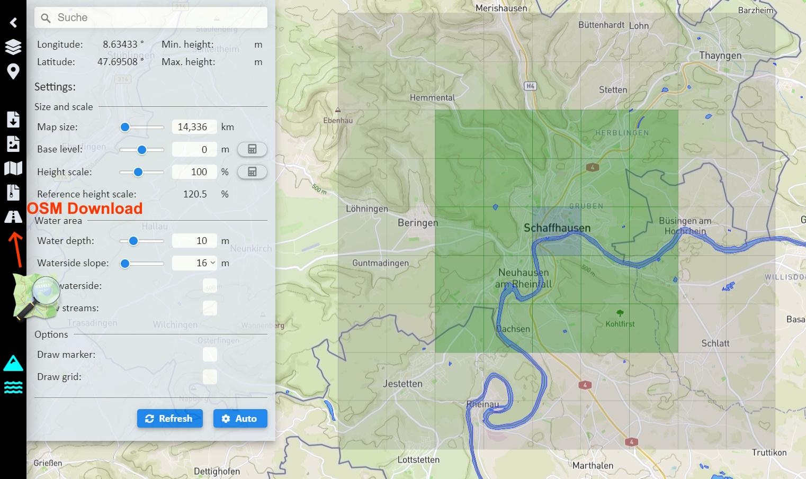
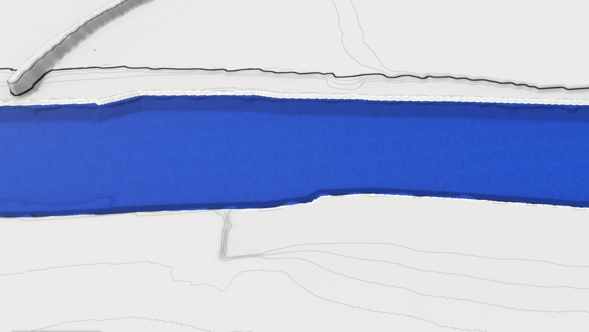
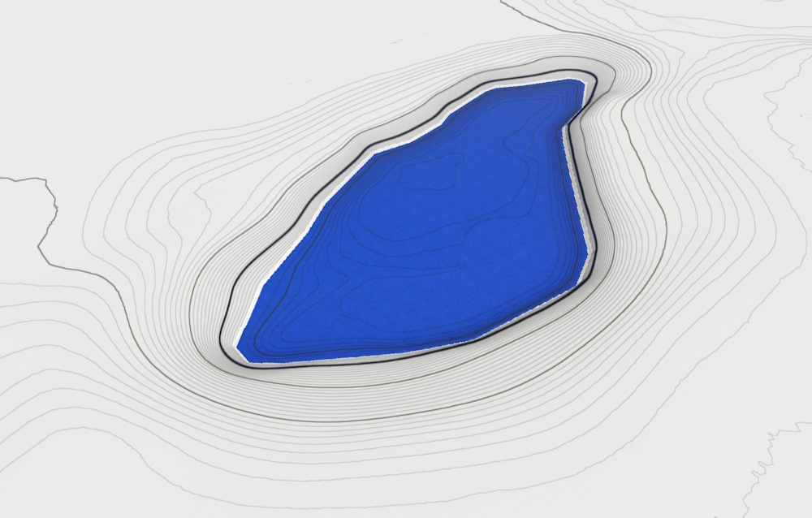
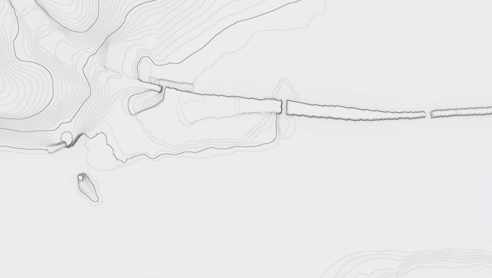
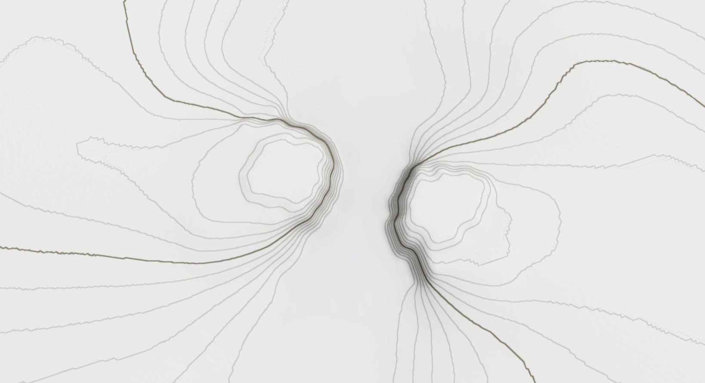
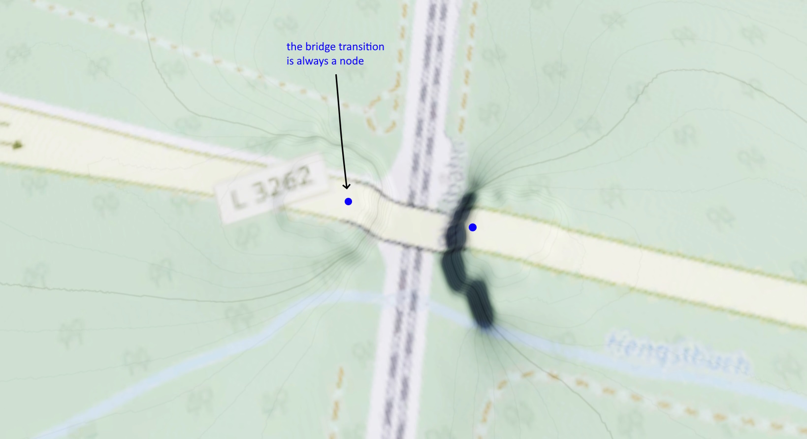
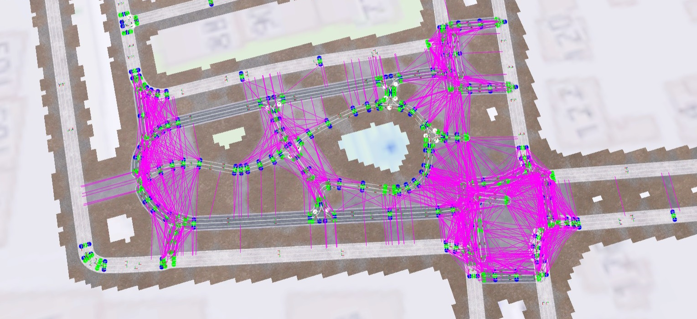
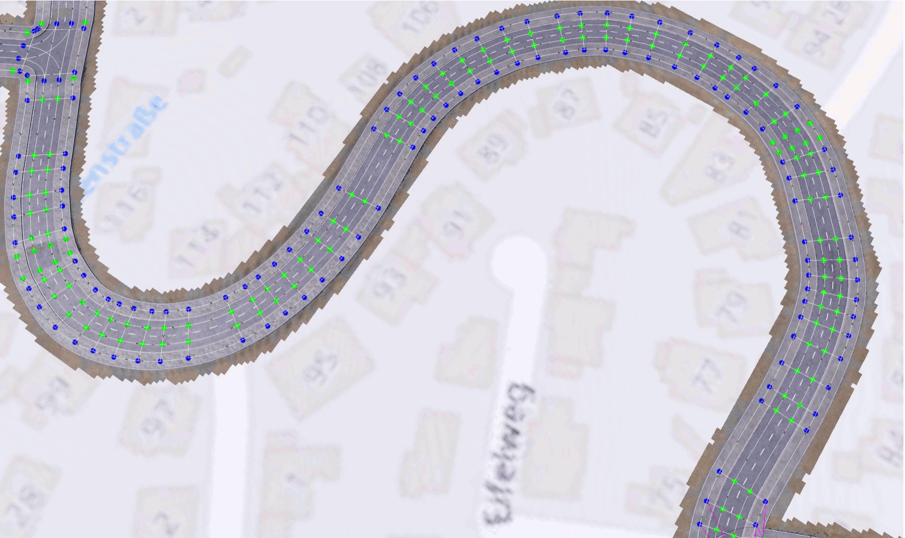
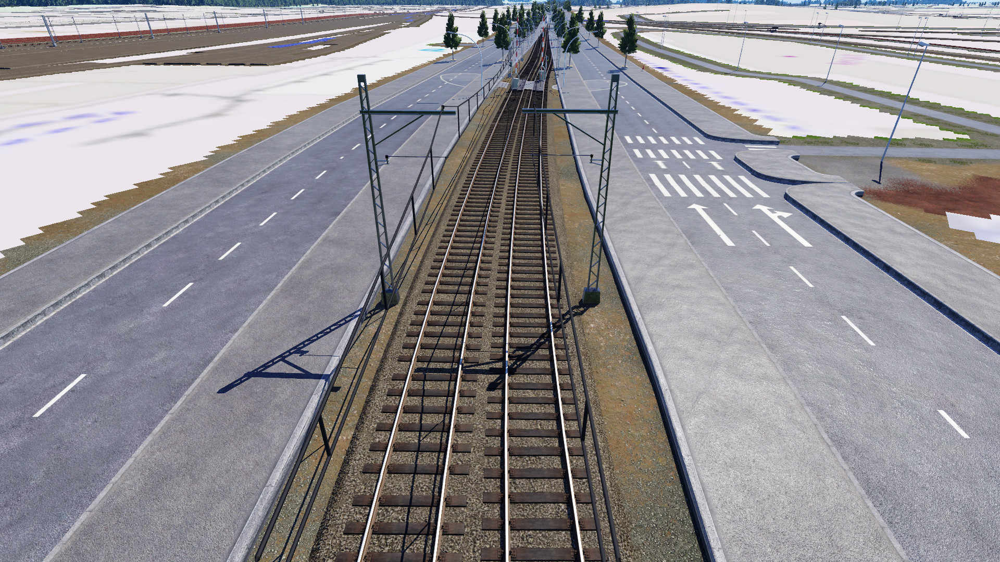

# TPF2-OSM Importer - Tutorial

This is a full tutorial on how to use OSM-Importer to get OSM data into TPF2.
As it covers only the use of this tool, general knowledge about "Replication" projects including some map preperations is expected and can be found in my [article in the forum](https://www.transportfever.net/lexicon/entry/398-real-nachbau-in-tpf-2/) (german).
Steam article (english) will follow.

Let's have a look on the toolchain first.
After you decided which realworld area to rebuild and obtained according OSM data, this data is run through a "Converter", realized in Python.
It does some data filtering, transformation, and optimizations to prepare the data for TPF2.
With the output Lua file, this tool is used as a mod and the import is done ingame by accessing the console.
The script will then read the data and build it automagically using the TPF2 modding interface.


However, some preperation of the map and terrain is required before the import to ensure the things are placed at the right height.
The result of the automated import will not be perfect of course.
After doing the postprocessing to fix some things manually, you can continue with the replication project with many other things not covered by this tool: train stations, lines, buildings, fields...


# 1. Define Map Size and Location
First, you need to decide the location and size of your map area.
Basic considerations for that are given in the article.

There is the question about size scaling, which allows to include more realworld area.
However, when using OSM Importer I recommend only 1:1 scale.
The reason is that everything has to be scaled down exactly and there is no room for improvised adjustments to leave certain parts out.
Scaling down train stations, curve radius, and urban streets will be a hassle already with 1:2.

A major challenge is the accurate alignment of heightmap, overlay, and OSM-imported things by using the exact same map bounds / coordinates.
This is important because the streets/tracks built by OSM importer should match with the overlay.
Ideally, you define the coordinates from the beginning.
Write them down.

<p align="middle"></p>

You could use https://heightmap.skydark.pl/ for planning your area.
It offers also OSM export which contains the bounds coordinates.
Be aware of the map size, as it should be the same as your TPF2 map, otherwise your scaling is not 1:1.
Also note, that the *exact* map length is always [a multiple of 256](https://www.transportfever.net/lexicon/index.php?entry/297-kartengr%C3%B6%C3%9Fen-in-tpf-2/).
Alternatively, you can use the OSM website (see Step 3) for planning, but then need to calculate the sizes elsewhere.
Zoom into the corners and make screenshots (this will be useful to align the overlay).

In case you already have a (empty) map with heightmap/overlay, you need to find out the coordinates of that.
You can show the location of coordinates in OSM by modifying a URL (as in [open_in_osm.py](/python/open_in_osm.py)).
You can also use the object query in OSM to reveal coordinates in the URL.


# 2. Prepare Overlay and Heightmap
You will need an ingame overlay, which is ideally OSM-based as well.
The overlay will be extremely useful to verify the import and reconstruct parts if objects are removed.
It is also needed to continue the replication project with other OSM information.

<p align="middle"></p>

The use of a heightmap is optional, but recommended for hilly regions.
The OSM import can also be done on a flat map, which makes things easier.
However, if you want to represent some elevation, terrain adjustments have to happen _before_ the import.

Information on how to create a heighmap and overlay can be found in the [Replication article](https://www.transportfever.net/lexicon/entry/398-real-nachbau-in-tpf-2/).

**Be very precise** when adjusting the data to your map bounds and use the defined coordinates!
A deviation of just a few meters between the overlay and the resulting objects will be annoying.


# 3. Get OSM Data
OSM data for a certain area can be exported quite easily.

## From the Website / Overpass
Visit [openstreetmap.org](https://www.openstreetmap.org) where you find 'Export' at the top.
With the Export Button you download directly from the main server, which has a size limit.
Better use Overpass for larger areas by clicking on "Overpass API".
You get a `map.osm` file which contains all OSM data for the area in XML format.

With your exact coordinates, you can call the Overpass API directly:
```
https://overpass-api.de/api/map?bbox=8.5969,47.6833,8.6698,47.7103
```

## With heightmap.skydark.pl
If you use https://heightmap.skydark.pl/ for your heightmap, the site has the option to download the according OSM data for the same area in one step (see above). 
This easily ensures that the coordinate bounds match.

## Geofabrik
[Geofabrik](https://download.geofabrik.de/) hosts predefined OSM files for certain countries/states.
This has the advantage that you can use data from a past point in time ([not possible via OSM Api](https://wiki.openstreetmap.org/wiki/History_API_and_Database)).
In this case you get a pbf file that contains a bigger area than your map area, which has to be cropped before (see [here](/python/README.md#usage)).


# 4. Map preperation (Terrain)
Now that you have the OSM data, you could (and should!) already jump to the next two steps and test the result to see how it looks in the game.
You will notice that several things look far from perfect, especially the terrain heights of tracks and streets.
Of course, the automation has its limitations, which is why pre- and post-processing is necessary.

You should allocate appropriate time and efforts for the map preperation because once the OSM import was applied, you have to live with the result and can only do manual adjustments.
We all experienced how painful terrain adjustments can be in Transport Fever and is nearly impossible if there are already streets and tracks everywhere.
The goal of OSM Importer is not having to rebuild large areas.
The terrain can be seen as the foundation of everything and should therefore be planned from the start.


## Rivers and Lakes
Water areas can still be edited after the import, however, they affect the terrain and can only be at one height in TPF2.
Therefore, you should start modeling the main rivers at the beginning.

If the heightmap did not already consider rivers, simply dig 5-10m and follow the water area.
For the shore around it, use 2-3m more than the water height. 
Also, look for complex intersections at low height - you don't want to dig on ground water when building an underpass.

Small rivers can show significant height difference along their path and lakes may be at another height than the water level.
If you want to use true water (and no textures) for them, you may need to do some digging and improvising in adjusting the surrounding area.

Small rivers and streams can be build as streets with water textures automatically by this tool.
They are carved 1m in the terrain, so you don't need to prepare something.

<p align="middle">
  
  
</p>

## Flattening
We all know that terrain can behave weirdly in TPF2 when building on unleveled ground.
(The swiss-like hilliness settings for new maps does not help.)
For example, as streets are not modeled to exhibit [Cross slope](https://en.wikipedia.org/wiki/Cross_slope), the game creates an even area at every crossing (even when only street type changes).
Also, the terrain can only change with a certain gradient, creating hassles when there are high height differences in small areas.
Keep in mind that train stations usually have no slope.
Thus, a flat map makes everything easier.

For these reasons, it is recommended to keep as many areas as possible flat.
Try to shift the slope away from infrastructures, e.g. to vegetation.
If you used a heightmap, feel free to generously flatten areas that are not apparently hilly.
In the end, heightmaps contain errors anyway and the goal is just to represent the significant terrain.

If your heightmap is coming from a DSM, keep in mind that the errors might be larger and e.g. forests will show unrealistic terrain increase.

<p align="middle"></p>

## Terrain / Embankments
OSM only consists of 2D data, there is no height information.
Thus, the heights have to come from a heightmap or by manual terrain editing.
Available heightmaps have horizontal resolutions of ~25m at best - this is not enough to represent embankments and bridges.
Thus, the high terrain differences they create on short scale has to be modeled manually.

You should plan the terrain thoroughly, especially when you rebuild urban areas, including densly built infrastructure.
This concerns especially railways as they typically have low slope.
Complex intersections can have 3 layers or more, which requires much space and embankments.
Not planning the terrain before the OSM import will only shift the problem and result in unrealistic slopes or forcing you to bulldoze and reconstruct large areas.

Look at the OSM overlay and think how the intersections are handeled with bridges/tunnels and the surrounding embankments.
Roughly sketch the heights with the terrain tools along tracks and streets.
It doesn't have to be perfect, slopes will be smoothened in the postprocessing later.
Check the slopes with [Track/Street Builder Info](https://steamcommunity.com/sharedfiles/filedetails/?id=2298331429).
Smoothen the terrain around it, so other paths will have reasonable heights.
It might make sense to build street pieces as fix points to ease the smoothening (they will be deleted later with a command anyway).

<p align="middle">
  
  
</p>

During the import, the height of tracks/streets is simply determined by the terrain height at the location of nodes (but only there!).
Bridge nodes are linearly interpolated between the endpoints, so they are not on the ground.
Thus, for bridges try to include the point where the bridge starts, so that the endpoints have a good position.

Depending on your map size and the infrastructure density of your area, this task may take some time, so don't underestimate this part.

## Bridge heights
Bridges (and tunnels) need a certain height difference, otherwise the result will be unappealing.
The following values have prevailed as minimum heights between streets and tracks.
Use this to bring the nodes to the right height.

- Bridge height over tracks with catenary: > 10-12m (depending on bridge thickness)
- Bridge height over tram catenary or tracks without catenary: > 8-10m
- Bridge height over normal streets: > 8m
- Bridge height over foot paths: > 6m


## Tips
- When editing the terrain, always have a look at the height (z coordinate), either with the layer window or more precisely with [Coordinates](https://steamcommunity.com/sharedfiles/filedetails/?id=1964343115).
- Use [Better Terrain Layer](https://steamcommunity.com/sharedfiles/filedetails/?id=1974981493) for better visibility of terrain height lines. 
If your hilliness is not swiss-like, the "Flat map" option will be useful.
- The accuracy of terrain lines when zooming out can be improved: Go to the debug settings (AltGr+D) and change "Terrain LOD error+radius" from 1 to 10.
- Map the key for the Terrain Layer to space. You will need to use it a lot. (there is no way to put the height lines on the map together with seeing the ground)


# 5. OSM-TPF Converter
This step refers to the [OSM-TPF Converter (Python)](/python). 
It will convert your OSM file into a Lua file.
The use of the python tool is explained in its [README](/python/README.md).

You need to use the Python code in there.
If not done already, download OSM-Importer on the [main page](https://github.com/Vacuum-Tube/OSM-TPF2-Importer) by clicking the green `Code` button and `Download ZIP`.
Unzip it, rename the folder to "`OSM_importer_1`" and put it in the mods folder.


# 6. Execute the Import in TPF2
This step refers to the [OSM Builder (Lua Mod)](/res/scripts/osm_importer).
The tool is used as a mod to complete the import in the game.
How to use it is described in this [README](/res/scripts/osm_importer/README.md).

Building tracks and streets can take a while. 
Before doing it for the whole map, you should test the import of Steps 3, 5, 6 with multiple small excerpts.
Inspect the results to find any issues that need to be resolved before the final import.
Check bridges and intersections and eventually reiterate the terrain preperations (Step 4).
Do this carefully before proceeding with the next step because once you did the import, you have to live with the result!


Also, check the performance you have after the import for the full map.
If your map is large, is densly built, or your PC is weak, performance can get critical, especially RAM usage.
You don't want to ruin your performance before actually starting with your replication project.
Check your RAM usage, including the pagefile (in windows use the resource monitor).
Directly after the import, it might be higher compared to save and reloading (and move a bit on the map to load everything).
If TPF2's RAM usage is significantly higher than your system memory, your pagefile will be heavily used, creating stutters, especially when you move the map.
In this case, you either need to buy more RAM or reduce the number of edges.
For the latter, you could skip all non-car streets/paths by deactivating the `build_streets_footway_types` option or skip certain OSM "highway" types individually in [sort_edges.py](/python/sort_edges.py).
The log file from the converter tells the number of edges of each type, so you can estimate the efficacy of skipping some types.
A rule of thumb is ~1GB RAM per 10 000 Edges.


# 7. Postprocessing

## Check Tracks
Tracks with no speed information in OSM are built as Ballast to recognize them and replace them with a suitable tracktype/speed
(you can change the fallback_type in [types_track.lua](/res/scripts/osm_importer/types_track.lua)).
The speed layer can be used to quickly detect these.


As curves in OSM are just modeled with many small straight segments, the node mapping may be imprecise sometimes.
This error is barely visible in maps, but not neglectible for games, like TPF2.
You will most likely detect crooked edges by the lowered curve speed.


## Revise Streets
Although most streets will not look that bad at first for simple geometries, it will get messy for more complex crossings, especially when multiple lanes are involved.
Often these advanced crossings cannot be represented in TPF2 anyway and have to be reconstructed in a simpler way.

The street type is derived from the data as good as possible, which is limited to the mapping details in the OSM tags and the available street mods in TPF2.
Thus, sometimes the street type may be inappropriate and needs to be changed.

When no appropriate street type could be determined, a red path is build as fallback (defined in [types_street.lua](/res/scripts/osm_importer/types_street.lua)).
Furthermore, the script for the street construction tries to repeat a failed proposal with this fallback type.
This way, you only need to upgrade it to a suitable type.
The red paths should be easy to find, so you know where to fix things.

## Useful mods for editing streets/tracks
Although the first result may look chaotic somewhere, there are many great mods available providing tools to edit existing streets/tracks.
With this, we can avoid the hassle of bulldozing and rebuilding.
Hopefully, you did a good job in the pre-processing - because then the nodes are already at the right height.

If not, the [Node Tool](https://steamcommunity.com/sharedfiles/filedetails/?id=2815956590) and [Move It](https://steamcommunity.com/sharedfiles/filedetails/?id=2980796229) can be used to adjust heights.

[Ramp Equalizer](https://steamcommunity.com/sharedfiles/filedetails/?id=2760877761) is an excellent solution to smoothen embankment ramps in front of bridges etc. as the terrain preperation can not ensure always the perfect heights.
It can also be used to level out bridges.

[Track/Street Modifier](https://steamcommunity.com/sharedfiles/filedetails/?id=2855421164) can be used to upgrade the track/street type, bridge type, replace embankments by bridges, or reverse direction (to switch side of poles or streetlamps).
Larger areas can be upgraded with [Global upgrade](https://steamcommunity.com/sharedfiles/filedetails/?id=2775806948).

[Track/Street Deleter](https://steamcommunity.com/sharedfiles/filedetails/?id=2806021490) and [Bulldozer++](https://steamcommunity.com/sharedfiles/filedetails/?id=2857104286) can be helpful when larger parts have to be deleted.
Bulldozer++ can remove specific street types. 


## Nodes Reduction
The OSM import can create a massive number of edges and nodes.
It has been shown that this leads to [significant RAM increase](https://www.transportfever.net/thread/20034-osm-importer-automatisierter-nachbau-mit-openstreetmap/?postID=404929#post404929).
Thus, it is reasonable to try to keep the number of edges minimal.
As curves in OSM are modeled by [many small segments](/python/README.md#curves), this creates a lot more edges than actually needed in TPF2, especially for sharp street curves.
Apparently, this also tends to produce exponentially many connection links.

<p align="middle"></p>

It should therefore be advantegous to replace all of these tiny edges with few curved edges.
Actually, this node/lane restructuring is done automatically by the game each time you interfere with existing streets.
We can therefore make use of this behavior by adding a street to a path with many nodes to trigger the node/edge simplification.
To ease this process, use [Self-deleting Track/Street](https://www.transportfever.net/filebase/entry/7376-self-deleting-track-street/) so you don't have to delete the street manually.

<p align="middle"></p>

Dead ends are sometimes modeled in detail with many nodes in OSM.
In TPF2, this should be simplified or replaced with dedicated [streets for dead ends](https://steamcommunity.com/sharedfiles/filedetails/?id=2557053030).

Tracks have a higher curve radius and thus don't suffer from this problem.
However, the node mapping is sometimes inprecise, leading to zig-zag.
Before rebuilding it, you could try also here to trigger the node restructuring with my tool.
Keep in mind that the intersection point will always become a new node.


## Verify Statistical Data
You can use [Advanced Statistics](https://steamcommunity.com/sharedfiles/filedetails/?id=2454731512) to detect and locate other unusual properties, for example by maximum track/street incline, curve radius, or the track/street types (e.g. the fallback types).
To check slopes and other data of individual entities, use the [Info-Tool](https://steamcommunity.com/sharedfiles/filedetails/?id=2645936377).

## Trams
If you used `build_tramtracks = false` you need to build tramways tracks in the classic way on streets via the tram parameter. 
As tram tracks are represented individually and not on streets in OSM, this can not be automated.

You might need to bulldoze large streets, when the street lanes are modeled individually as oneway, and replace with one big street.
Tram tracks in the middle can be achieved with [eis_os street package](https://www.transportfever.net/filebase/entry/6263-eis-os-strassenpaket-strassen-mit-rasengleis-mitteltram/).

<p align="middle"></p>

## Motorways
Motorways with structurally separated lanes are represented as two one-way lanes in OSM.
However, if you want to use [the Autobahn Mod](https://www.transportfever.net/filebase/entry/5157-autobahnkreuz-tpf2/) anyway, use `build_autobahn = false` to avoid those lanes being built.
After the import you can lay the dedicated Autobahn directly. 


# 8. Use Overpass to add OSM data by hand
Not all OSM data can be built automatically in TPF2 due to logical, technical, or practical reasons.
Anyway, after the automatic import, OSM data can still be used in a manual way to add this real world information into the game in a straight forward way.

The [Overpass turbo API](https://wiki.openstreetmap.org/wiki/Overpass_turbo) provides a flexible way to quickly visualize specific OSM information.
This can be quite useful in finding the information.

Some Examples:
- Power Lines: [Tag "power"="line"](https://overpass-turbo.eu/?template=key-value&key=power&value=line) and ["power"="minor_line"](https://overpass-turbo.eu/?template=key-value&key=power&value=minor_line)
- Railway signalling signs: [Tag "railway:signal:speed_limit"](https://overpass-turbo.eu/?template=key-value&key=railway:signal:speed_limit&value=DE-ESO:lf7) and ["railway:signal:speed_limit_distant"](https://overpass-turbo.eu/?template=key-value&key=railway:signal:speed_limit_distant&value=DE-ESO:lf6) ([this mod](https://steamcommunity.com/workshop/filedetails/?id=1966094307) can be used)
- Power rail: ["electrified"="rail"](https://overpass-turbo.eu/?template=key-value&key=electrified&value=rail)
- Fountains: ["amenity"="fountain"](https://overpass-turbo.eu/?template=key-value&key=amenity&value=fountain)
- Supermarkets: ["shop"="supermarket"](https://overpass-turbo.eu/?template=key-value&key=shop&value=supermarket)
- Wind turbines: ["generator:source"="wind"](https://overpass-turbo.eu/?template=key-value&key=generator%3Asource&value=wind)
