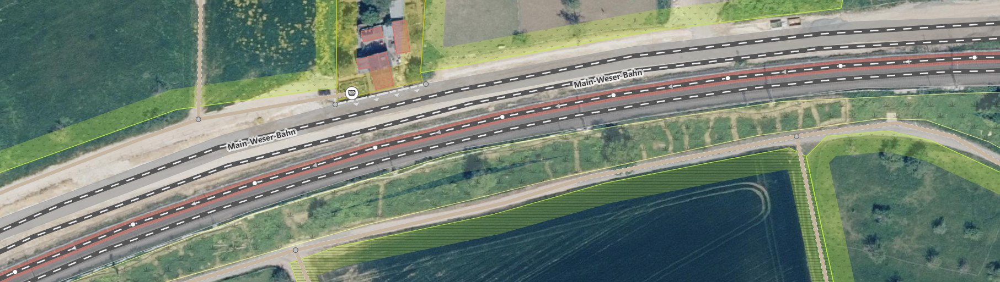
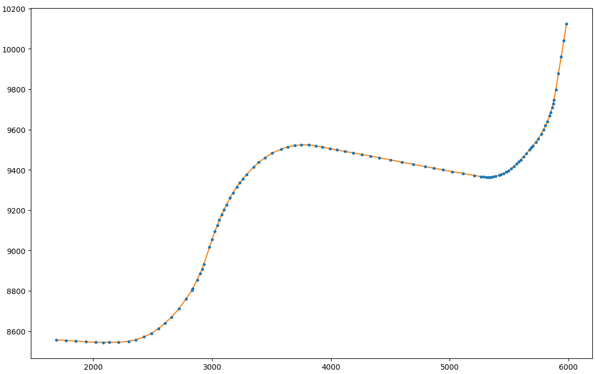
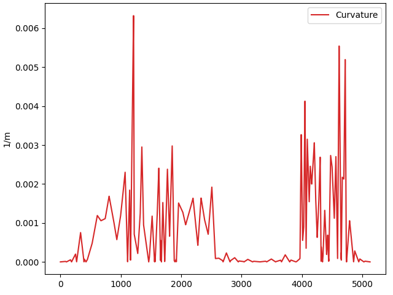
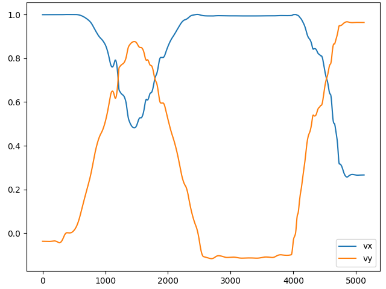
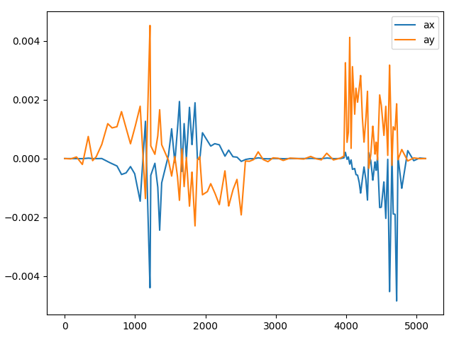
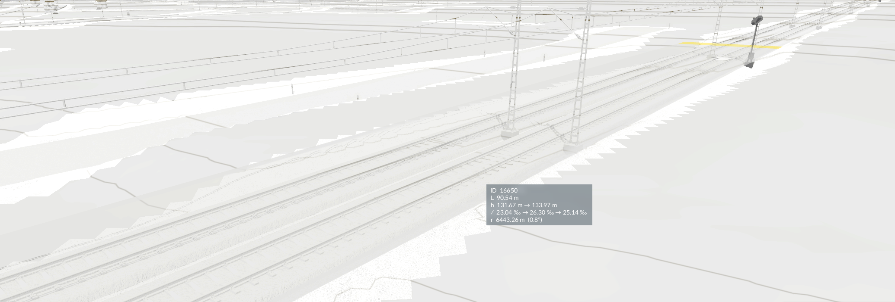

# OSM-TPF Converter (Python)

The Converter is an intermediate step between the OSM data and [OSM Builder](/res/scripts/osm_importer/) (the Lua part) to facilitate the data processing and prepare it for TPF2. 
This tool is a Python script that converts the OSM data to a convenient Lua file.


# Overview

The input of the Converter is an OSM file that contains OSM data for your relevant area to be rebuild (see Tutorial for how to get OSM data).
The file needs to end with `.osm`

Your OSM file should only contain data within your map bounds.
In case you use a predefined OSM file (e.g. Geofabrik) with an area larger than your TPF2 map, you first need to crop it to your map bounds by using [crop_osm.py](crop_osm.py) and Osmosis (more info [here](osmosis/README.md)).

Before running the converter, you need to specify the map size and coordinates for your case.
Find out the size of your TPF2 map, i.e. horizontal map lengths in meters. 
Find the **exact** values [here](https://www.transportfever.net/lexicon/index.php?entry/297-kartengr%C3%B6%C3%9Fen-in-tpf-2/) (unfortunately the sizes in the [wiki](https://www.transportfever2.com/wiki/doku.php?id=gamemanual:mapsizes) are approximated) or with [Advanced Statistics](https://steamcommunity.com/sharedfiles/filedetails/?id=2454731512).
Also, you need to be aware of the coordinates representing the bounds of your map (see Tutorial).
You should have them already defined, as the same coordinates should be used for the heightmap, overlay, and the OSM file.
Nevertheless, the converter reads the bounds from the OSM file and prints them in the log.

It is highly recommended to test the import for several small sub-areas (within your map bounds) before doing the import for the whole map.
The command doesn't need to be adjusted for this - simply export an area from OSM and convert it.
The sub-area should then be built at the correct location on the map.

Technically, all node coordinates will be transformed in a way such that the map bounds coordinates are scaled to the length of the TPF map so that they are mapped exactly to the border of the map. 
Therefore, it is your responsibility to check the sizes (and ratio if your map is not square).

There are two methods how to use:


# Method 1: Use Python with virtual environment
To run Python code, you usually need to install Python.
Python is a script language, like Lua.
If you want to modify the code, you need to use this method.

Install [Python](https://www.python.org/downloads/) (3.9).
Windows users can download Python from the [Microsoft Store](https://apps.microsoft.com/detail/9p7qfqmjrfp7).

To run OSM-TPF Converter, create a local virtual environment.
Navigate to this folder "python" in the console, then:
```
python -m venv venv
```

Install the required packages:
```
pip install -r requirements.txt
```

You can then execute the script with:
```
venv/Scripts/python main.py
```
If you are on Windows, you can use [run_venv.bat](run_venv.bat) .

For specifying your information, you can either edit [main.py](main.py) or use arguments for the command (which override the defaults in the file).
For the use with arguments, see Method 2.

The input file is set by the variable `INFILE`.

The map size is set by adjusting this line:
```python
bounds_length = (16384, 16384)  # for size "Very Large" 1:1
```

The coordinates can be modified here:
```python
bounds = {
    "minlat": 47.6833, "minlon": 8.5969,
    "maxlat": 47.7103, "maxlon": 8.6698,
}
```


# Method 2: Use Exe (Windows)
If you are Windows user and don't want to install Python, you can use the exe application.

Find the current version in [Releases](https://github.com/Vacuum-Tube/OSM-TPF2-Importer/releases).
Download and extract the Zip file.
Put your exported OSM file in the same folder.

Run `main.exe` in the command line with specified arguments.
You can use the attached `run.bat` file as template.

The input arguments are:
- **Arg 1**: Input file (.osm)
- **Arg 2**: Output file (.lua)
- **Arg 3**: Size of TPF2 map (comma-separated x and y length)
- **Arg 4**: Coordinates (comma-separated minlat, minlon, maxlat, maxlon)

An example command looks like this:
```
main.exe map.osm osmdata.lua 16384,16384 47.6833,8.5969,47.7103,8.6698
```


# Run

Now execute main.py or main.exe. 
This can take a few minutes.

There is no visible sign of progress in the command window because all log messages are written to the logfile `log.txt`.
If you clicked on the .bat wait patiently until the window disappears!

If it runs successfully, the output file `osmdata.lua` is created. 
This file is needed for the next step to build the data ingame.

If the file is not created, have a look into `log.txt` for any error messages.
Maybe the command is not correct.
If you can't resolve the error, send me your log file and .osm file.

The log contains general information about the OSM data, e.g. town/city names.
At the end of the file, you find the resulting number of single street and track edges to be built in TPF2, broken down by types. 
This will be useful later to estimate execution time of the constructing process and whether to exclude some street/path types due to performance reasons.

The log also contains information about the size of the area that can be used for verification.
The real distance between the bound coordinates in meters is printed in the log. 
```
Distance of bounds: lon=24747-24634m , lat=24560m 
```
Note, that the longitudal length differs from the south to the north. 
This is the moment, when you realize *that the earth is not flat...* and start thinking about projections (more info in details).
Compare this to your actual map length. 
They don't have to match exactly (which is not possible anyway), but should be about correct. 
If you don't plan a 1:1 reconstruction but a scaled one, you need to account for the respective factor here.


# Details

What is actually happening here?

## Data Extraction

The script reads the OSM XML data and stores all OSM entities, i.e. Nodes, Ways, and Relations, in Python dicts. Then it
iterates over all of them to extract, process, and transform the data. Only the important information for TPF2 are
stored in a separate data structure. The relevant content of the OSM tags is processed and converted into a simple form
to reduce coding efforts on the Lua side.

From **Nodes**, the following object types are extracted: location of "places" (towns, quarters, etc), signals,
switches, asset objects (single trees, fountains, bollards, advertising column).

**Ways** include streets, tramways, tracks, streams. OSM Ways span over a list of nodes (while TPF2 edges always
conncect two nodes). 
Therefore, the OSM ways are cut into single edges.

**Areas** in OSM can be defined as a closed **Way** or as a **Relation** (multipolygon). Forests and Shrubs areas are
determined.

## Coordinate Transformation

Nodes in OSM are equipped with geographic coordinates (WGS84) between -180° and 180° longitude and -90° and 90°
latitude. For TPF2 we need to convert them to meters. This brings us to projections. Most tiled web maps (OSM, GMaps,
etc) visualize the earth as 2D Map by using the Web Mercator (EPSG 3857) projection. Therefore, it is also used here.
Because the output of the transformation is not the true meter distance, we still have to provide the intended length of
our bounds to scale to it. Mercator implies that longitude and latitude axes will stay straight lines, which is useful.
However, lengths are distorted.

At the sizes of TPF maps, this fact is barely recognized visually, but in numbers it's more than you think!
In my case, I determined the coordinates aftwards from my overlay and a terrainparty screenshot (not the most accurate
way). The lengths very supposed to be megalomaniac (24576), but were calculated as lat=24560m and lon=24747m (at south)
and 24634m (at north). This divergence cannot be avoided. I wonder how it is with https://heightmap.skydark.pl/ . It
does seem to not pose a big problem. The accuracy between my overlay and built stuff is <5m. However, if you have to
estimate your coordinates, it might make sense to try to somehow adjust the lengths (printed in the log) to the map
lengths.

## Curves

Although streets and tracks are modeled in both OSM and TPF2 as nodes and edges, there are some differences. 
In maps like OSM and Google Maps, there exist no true curves!
If you look closely, you can see that curves simply consist of many small (straight) segments, which is sufficient for the visualization.
In a game like TPF2, where more accurate representation is needed, curves [are modeled as Hermite Curves](https://www.transportfever.net/lexicon/entry/356-kurven-konstruieren/), i.e. [cubic splines](https://en.wikipedia.org/wiki/Cubic_Hermite_spline). 
This requires to determine tangent vectors for the edges, which should match at each node. 
This is especially important for tracks, as otherwise your trains would go [zig-zag](https://www.youtube.com/shorts/8kS80uvRL3U). 
But also for streets it turns out that it's useful to align the tangents, at least for low intersection angles.

<p align="middle"></p>

To tackle this, I create graphs of the track and street network using `networkx`. 
With this, we can extract the "paths", i.e. a list of nodes that represents a continous way of a street, track, or tram. 
Paths are similar to the Ways provided by OSM, but can also span over several Ways.
Until version 1.2 the approach of [OSMnx](https://github.com/gboeing/osmnx/blob/main/osmnx/simplification.py) was used and adapted for undirected graphs.
Here, a path always ended between crossings, i.e. nodes with degree>2.
With the new approach, the geometry is much better because the paths span beyond crossings, e.g. switches in a rail yard.

Things always got complicated when there are tracks on streets.
A lot of workarounds for these edge cases was needed.
Not only can a OSM way say it is a "highway" and "railway" simultaneously but it also happens that there are multiple parallel ways using the same nodes.
In the end, the infrastructures cannot be modeled as a simple (directed) graph, but could be seen as a [multigraph](https://en.wikipedia.org/wiki/Multigraph).

Consequently, the normalized tangents along the path for a node $n_1$ with position $p_1=(x_1,y_1)$ can be calculated as the average of the tangents $t_{01}=(p_1 - p_0)$ and $t_{12}$ of the two neighboring edges behind and after the node, which is the same as the tangent created by the previous and the following node:

$normalize(t_{01}+t_{12})=normalize(p_2-p_0)$

This is also known as the _Catmull–Rom spline_ and was used until version 1.1.
A better method is the [Natual cubic spline](https://en.wikipedia.org/wiki/Spline_interpolation) because it ensures not only matching tangents but also matching curvature at the transition points!
This is actually closer to [real track geometries](https://en.wikipedia.org/wiki/Track_geometry), which consists only of the three types: straight lines, arcs with constant radius, and [transition curves (clothoids)](https://en.wikipedia.org/wiki/Track_transition_curve).

An exemplary path of OSM points and its spline with associated first two derivatives and curvature is shown.
Obviously, OSM data is not so smooth as it looks at first.

<p align="middle">
  
   
</p>
<p align="middle">
  
   
</p>

At all switches, the tangents are aligned in their direction, so that TPF2 is happy and can build them.

With the z value (height), the tangent calculation is done differently because splines can lead to overshooting, i.e. more curvature than wanted.
Here, the z-tangent at node $n_1$ is chosen as the minimum of the adjacent tangents (normalized, i.e. slopes) $t_{01,z}$ and $t_{12,z}$ and 0 if they have different sign, to keep slopes low at the nodes. 
This will lead to better geometry. 
The implementation is located in the Lua part because the height is only determined in the game from the terrain.

Before that, the z values are smoothened along paths by sampling the terrain on the edges between the nodes.
This way, the exact node position becomes less important and terrain jumps can be smoothened out.
This is useful because you don't want to consider nodes positions during terrain preperation.
E.g. if the nodes of two tracks are not symmetric, the tracks will differ in height.
The method used here is a Gaussian filter.
Tracks are smoothed with sigma=50 and streets with 25 meters.
However, it is not perfect as it only works with fixed window size and cannot prevent too high slopes.
For this, a non-linear filter would be necessary that can "shift" slopes above a limit to the path before and behind.

<p align="middle"></p>

## Other Edge Optimizations

Additionally, we want to avoid very long edges, as they can cut through terrain, since the height is only determined at nodes. 
Also, long edges can create issues for the spline interpolation.
The code is splitting edges that are longer than a maximum value (actually the game does the same when you lay streets or tracks).

Very short pieces of track can also be annoying and create too much curvature, when the node mapping was done unprecisely. 
There is a function to calculate the curvature along the curve.
If the curvature is too high, the code deletes nodes if possible and merges the remaining edges.
This improves the smoothness of the curves significantly.
Moreover, there is a function to remove nodes of short segments in general if the resulting curve makes them unnecessary.
This can save a lot of nodes/edges in the game.

Railway signals are another example of differing data representations. In TPF2 they are connected to an edge, while in
OSM signals are nodes. The transformation is done accordingly, such that signals are placed right in front of catenary
poles (because TPF2 tends to place poles at nodes).

## Edge Sorting

Lastly, the edges are sorted to their [type of track](https://wiki.openstreetmap.org/wiki/Key:railway) and street/path (which is called [highway](https://wiki.openstreetmap.org/wiki/Key:highway)). 
This way, the "more important" edges can be built first to increase the chance of successful construction. In [sort_edges.py](sort_edges.py), this order can be
adjusted. You can also ignore some of the highway types that you don't want to include. 
Depending on your PC and map size/density, it may be necessary to reduce the number of edges. 
Have a look in `log.txt` for the number of edges of each type.
